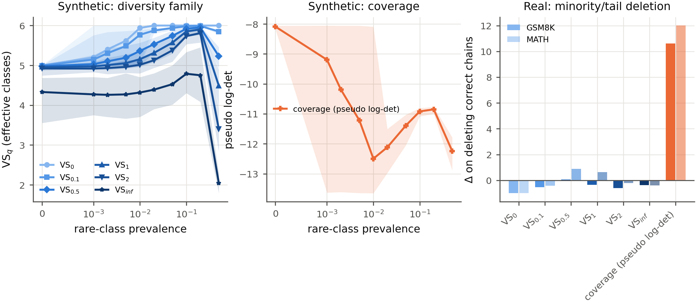
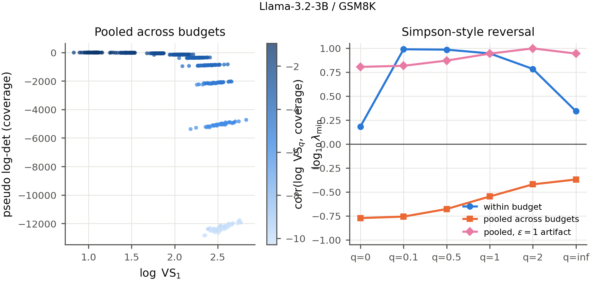
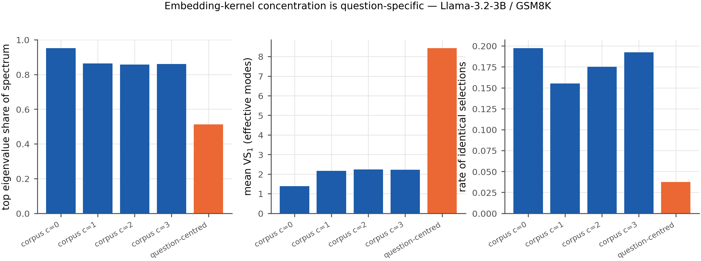
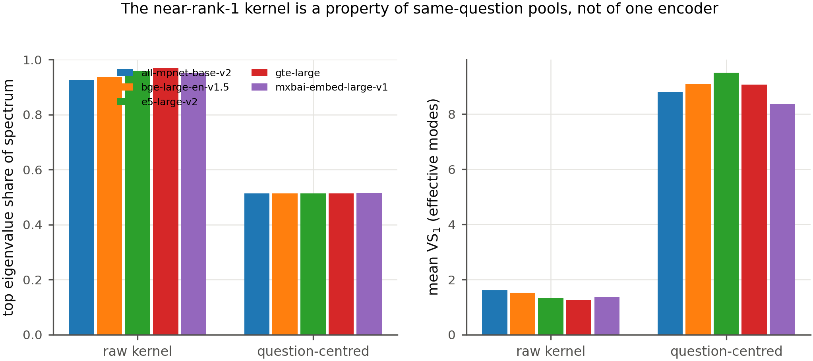
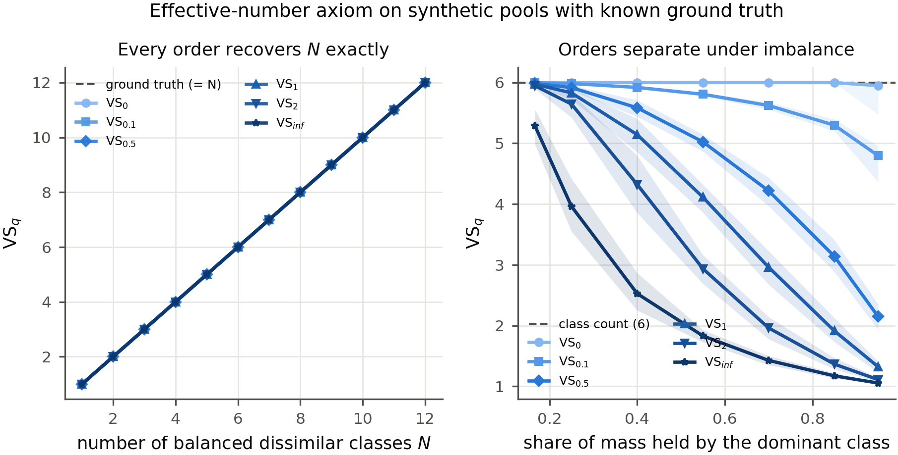
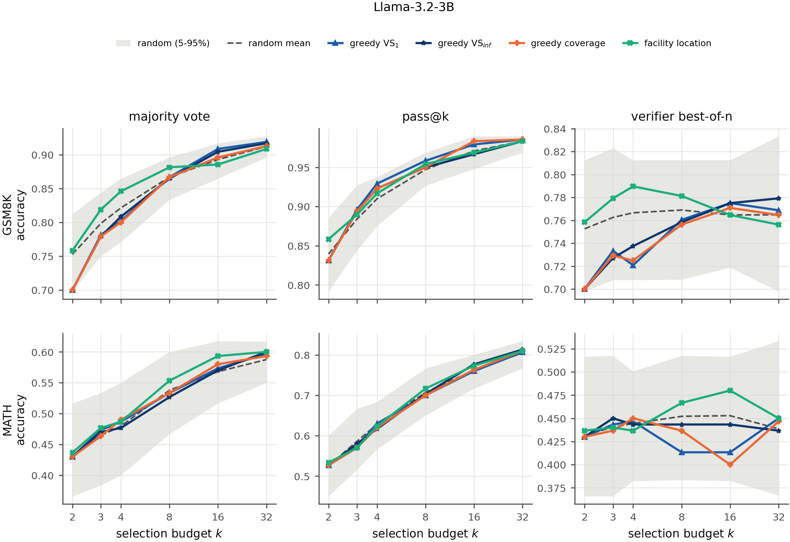

# Diversity vs. Coverage as Measures of Variability, and Their Impact on LLM Reasoning

Diversity and coverage are two ways to quantify how much variability a set of
items contains. **Diversity** is the Vendi Score family `VS_q` — the exponential
of the **Rényi** entropy of order *q* of the spectrum of a normalized similarity
kernel ([Friedman & Dieng 2023][vs], [Pasarkar & Dieng 2024][cousins]).
**Coverage** is the **pseudo log-determinant**: the sum of the logs of the
*nonzero* eigenvalues of the same kernel, the DPP log-volume
([Kulesza & Taskar 2012][dpp]).

**Every order q is a diversity measure**, including the q → 0 richness limit.
Coverage is a separate functional and is never a member of the family.

This study asks how the two differ as measures of variability (**RQ1**), and how
those differences then affect LLM reasoning (**RQ2**, built on RQ1).

---

# RQ1 — How do diversity and coverage differ as measures of variability?

## (a) Are they limiting cases of one order-q family?

**No, and the data says so directly.** If coverage were the low-q limit of the
diversity family, VS₀ (richness) would be the order most like it. Measured at a
fixed budget across all six cells, the opposite holds:

| | correlation with coverage |
|---|---|
| **VS₀** (the low-q limit) | **−0.17 to +0.29 — essentially none** |
| VS₁ | **+0.88 to +0.96** |

The low-q limit is the member of the family *least* like coverage. They are
distinct functionals: `VS_q` is an effective **number** bounded in [1, n];
coverage is a log **volume**, unbounded below, that diverges as any eigenvalue
approaches zero.

## (b) How do their sensitivities differ?

<p align="center">
  
</p>

**Rare modes.** As a mode's prevalence vanishes, low-q diversity holds near the
mode count while high-q ignores the rare mode entirely; coverage diverges as the
corresponding eigenvalue enters the null space.

**Redundancy.** The two duplication regimes must be separated. Under **uniform**
duplication the normalized spectrum is untouched, so *every* functional is
exactly flat. Under **skewed** duplication (a random subset copied) VS_q falls
**and coverage moves too** — coverage is invariant only to uniform duplication,
not to duplication in general.

**Sample size.** Rank stability against subsample size differs by order; the
smallest n reaching Kendall τ ≥ 0.9 is reported per functional (TB-1).

**Dimensionality.** Over PCA dimensions d = 8 → 1024 on the same pools:

| | d = 8 | d = 1024 | scaling |
|---|---|---|---|
| VS₁ | 4.8 | 13.0 | ~3× |
| coverage | −25.7 | −12,280 | **~500×** |

Coverage is dramatically more dimensionality-sensitive, and the reason is
structural: the pseudo log-determinant sums `log λ` over *every* nonzero
eigenvalue, so its magnitude grows with the rank of the kernel, while `VS_q` is
an effective number bounded by the item count. Comparing coverage values across
different embedding dimensions is therefore not meaningful without
renormalization; comparing VS_q values is.

## (c) How are the two log functionals related, and when do they diverge?

<p align="center">
  
</p>

Within a fixed budget, log VS_q and coverage correlate **strongly positively**
(r up to +0.998) — locally both read the same bulk spectrum. Pooled across
budgets the correlation **flips negative**: a Simpson-style reversal with budget
as the confounder, because coverage is dominated by the smallest eigenvalues.

Two refinements this study adds:

- The reversal is **specific to continuous kernels**. On the answer kernel the
  two are anti-correlated at *every* scope.
- The `ε = 1` variant (`Σ log(1 + λ)`) is **positive everywhere**, hiding the
  divergence completely. It is not an approximation to the pseudo log-determinant.

## The measurement precondition: the kernel must be fixed first

<p align="center">
  
</p>

Both functionals are functionals *of a similarity kernel*, so what they measure
is decided by the kernel. On pools of chains that all answer **the same
question**, the raw sentence-embedding kernel is nearly rank-1: the leading
eigenvalue holds **94%** of the spectral mass and `VS₁ ≈ 1.4` among 40 lexically
distinct chains. That is not the score misbehaving — distinct strings need not
be dissimilar, and the score is faithfully reporting that, to the encoder,
chains about one question look alike. But it means the raw kernel measures
*which question is being answered*, not *how the chains differ in answering it*
— and under it, different objectives pick the *same* chains 22% of the time,
leaving the diversity-vs-coverage comparison nothing to distinguish.

The standard anisotropy correction (removing corpus-wide directions) **barely
helps** — VS₁ reaches only 2.15, because the concentration is
**question-specific**: no small set of corpus directions can remove 96 different
question topics. Re-expressing chains as deviations from **their own question's
centroid** — an experimental representation targeting within-question
variability, not a claim that the raw kernel computes VS wrongly — restores
VS₁ ≈ 9.3 and drops identical selection to 0.06. Replicated on 3 models, 2 model
families, 2 datasets.

<p align="center">
  
</p>

**It is not an artifact of one encoder.** Repeating the diagnosis on the same
chains under five encoder families — BGE, MXBAI, E5, GTE, MPNet — gives the raw
top-eigenvalue share in **0.922–0.975** and raw VS₁ in **1.20–1.67** every time,
collapsing to **0.512–0.515** and **8.35–9.90** after question-centring. The
near-rank-1 kernel is a property of same-question chain pools, not of any
embedding model.

This is consistent with the earlier observation that text embeddings are nearly
blind to final answers: the same-vs-different answer cosine gap is only ≈ +0.02
even after correction.

<p align="center">
  
</p>
<p align="center"><em>The effective-number reference points: N mutually dissimilar classes score exactly N for every order q (left); the orders separate under imbalance (right).</em></p>

---

# RQ2 — How do those differences affect LLM reasoning?

<p align="center">
  
</p>

## (a) and (b) When does diversity win, when does coverage, and under which rule?

**The variability space decides whether the two differ at all.** On the
question-centred *embedding* kernel they are statistically indistinguishable in
the large majority of conditions (149 of 162 ties). On the *answer* kernel they
separate sharply — and the aggregation rule picks the winner, with no exceptions
across six model×dataset cells:

| aggregation rule | winner | mean (diversity − coverage) | vs random: diversity | vs random: coverage | cells agreeing |
|---|---|---:|---:|---:|---|
| **pass@k** | **diversity** | **+0.169** | +0.033 | −0.135 | **6/6** |
| **majority vote** | **coverage** | −0.161 | −0.190 | −0.029 | **6/6** |
| **verifier best-of-n** | **coverage** | −0.211 | −0.173 | +0.039 | **6/6** |

Each verdict is the **paired per-question difference** between the diversity arm
(VS₁) and the coverage arm — comparing each to random separately cannot say
which is better, since both can beat random while being indistinguishable from
one another.

**It is not an artifact of the subsample size.** The table above is measured at a
40-chain pool. Repeating the whole comparison on the **full 1024-chain pools**
reproduces every sign with larger magnitudes — pass@k +0.300 to diversity,
majority vote −0.266 and verifier best-of-n −0.274 to coverage, still 6/6 —
while the embedding kernel stays a tie in 160 of 162 conditions (|Δ| ≤ 0.016).
The separation grows with pool size rather than washing out.

**The mechanism is exact, not statistical.** On a block kernel, greedy VS_q
picks one chain per distinct answer. The pseudo log-determinant is maximised by
picking a *single* class repeatedly: at budget 4, composition `[4]` scores
**0.000**, `[2,2]` scores −1.386, `[1,1,1,1]` scores −5.545. Excluding zero
eigenvalues makes exact duplicates free, so concentrating mass maximises it.
Spreading helps you *hit* an answer (pass@k); concentrating helps you form a
confident mode (voting, verifier).

> **A framing correction this exposes.** Selecting "one chain per distinct
> answer" maximises **richness, VS₀** — the q → 0 member of the *diversity*
> family, not coverage. The pseudo log-determinant does the opposite.
> Attributing a pass@k gain on minority-answer questions to *coverage* assigns a
> diversity effect to the wrong functional.

**Winning the head-to-head is not the same as being useful.** Against random,
diversity gains on pass@k (+0.033) while coverage does *not* beat random on
majority vote (−0.028), and at the full pool it does not beat random on the
verifier rule either (−0.043). The head-to-head says which of the two measures
to prefer for a given rule; the vs-random columns say whether either is worth
using at all — and for several rules neither is.

## (c) How does it depend on tail-heaviness?

Tail-heaviness — where the correct answer ranks in the pool's answer
distribution — is what the conditioned results are organised by. The partition
is qualitative and was fixed in advance: **modal** questions cannot be lost by a
vote, **absent** questions cannot be won by any selector, and only the
present-but-not-modal remainder is contestable.

> **A retracted intermediate claim.** An earlier five-cell analysis suggested
> the *size* of that contestable share predicted the achievable gain
> (r = +0.6 to +0.75). At the final scale the correlation collapsed (pass@k
> r = +0.06; negative for the other rules). That pattern was a small-sample
> artifact and is retracted; only the qualitative partition stands.

---

## Study design

| Axis | Values |
|---|---|
| **Diversity** | VS<sub>q</sub>, **q ∈ {0, 0.1, 0.5, 1.0, 2.0, ∞}**, via the pinned [vertaix/Vendi-Score][repo] `score_K` |
| **Coverage** | pseudo log-determinant = sum of logs of the **nonzero** eigenvalues; τ ∈ {1e-8, 1e-10, 1e-12}; ε = 1 arm kept as the artifact control |
| **References** | facility location (representativeness); random ×20 seeds, the baseline in every comparison |
| **Models** | Qwen2.5-0.5B · Qwen2.5-1.5B · Llama-3.2-3B (pass@1 0.27 → 0.71) |
| **Datasets** | GSM8K ([Cobbe et al. 2021][gsm8k]) · MATH levels 1–5 ([Hendrycks et al. 2021][math]) |
| **Questions** | 192 / 96 / 96 (GSM8K); 180 / 120 / 60 (MATH, level-stratified) |
| **Chains** | 1024 per question; T = 1.0, top-p 0.95; 761,856 chains (811,008 with seed-variance banks) |
| **Variability spaces** | K<sub>emb</sub> (question-centred primary; raw + corpus-anisotropy arms) · K<sub>ans</sub> · K<sub>α</sub> interpolating between them, α ∈ {0 … 1} |
| **Selection** | greedy per objective (batched, provably identical to naive greedy); k ∈ {2,3,4,8,16,32}; pools of 40 and 1024; every arm averaged over 5 subsample draws |
| **Aggregation** | majority vote ([Wang et al. 2023][sc]) · pass@k ([Chen et al. 2021][passk]) · verifier best-of-n |
| **Hardness** | Snell pass@1 quantile bins ([Snell et al. 2024][snell]) · MATH levels 1–5 · answer entropy |
| **Tail-heaviness** | modal · minority (2–5) · tail (>5) · absent |
| **Dimensionality** | PCA d ∈ {8 … 1024} (RQ1(b)) |
| **Encoders** | bge-large primary; mxbai, E5, GTE, MPNet for kernel robustness |
| **Statistics** | paired bootstrap ×1000 · Holm within families · **replication across models as the evidence standard** · practical null at \|δ\| < 0.01 |

## Robustness

| check | result |
|---|---|
| generation-seed variance (g ∈ {0,1,2}, full regeneration) | pass@1 sd **0.0096** vs effects of 0.02–0.07 |
| cross-encoder rank stability | τ ≈ 0.83–0.90 for coverage and every q ≥ 0.1 |
| Eq. 7 monotonicity and Eq. 8 bound | **0 violations in 1,728 real spectra** |
| effective-number axiom | exact for every q on synthetic pools |
| MATH answer-equivalence oracle, audited on 2,772 real answers | **0 false merges, 0 false splits** vs an independent numeric adjudicator |
| kernel validity (symmetric, PSD, unit diagonal) | enforced for every kernel variant |
| implementation vs published equations | 36 tests transcribing Eq. 1, 6, 7, 8 and Thm 4.1 |

**VS₀ is excluded from winner claims on continuous kernels.** [Cousins][cousins]
calls q = 0 "an uninformative measure of diversity"; greedy VS₀ picked the eight
lowest-indexed chains on 20 of 20 pools (index, not content, selection); and its
cross-encoder rank stability is τ = 0.34 against ≈0.88 for every other order.

## Documentation

| file | contents |
|---|---|
| **[assets/learn.md](assets/learn.md)** | **full walkthrough** — the measures from Hill numbers up, every design decision, every result, every error found, and how to defend each claim |
| [RESULTS.md](RESULTS.md) | all numbers, hypothesis strip, limitations |
| [FIGURES.md](FIGURES.md) | all figures and tables, with colour semantics |
| [LITERATURE.md](LITERATURE.md) | equation-by-equation alignment with the defining papers |
| [TRIAGE.md](TRIAGE.md) | every deviation from the plan and its justification |
| [ENVIRONMENT.md](ENVIRONMENT.md) | pinned versions and reproduction environment |

## Data

All chain banks — 1024 chains per question with embeddings, per-chain logprobs,
and provenance manifests — are published at
[`GOVINDFROM/Diversity-vs-Reasoning`](https://huggingface.co/datasets/GOVINDFROM/Diversity-vs-Reasoning).

## Reproduce

```bash
make bootstrap                      # environment (pins the Vendi-Score commit)
make gate                           # blocking correctness harness (T1-T12 + paper alignment)
zsh scripts/run_campaign.sh         # generate chain banks on Modal (A100)
python scripts/run_analysis.py all  # pull banks, analyse every cell, assemble
python figures/render_paper.py      # every figure (PDF + PNG) from cache only
python scripts/write_results.py     # RESULTS.md, no hand-entered numbers
```

No number enters a figure, table, or results file by hand.

## References

- Friedman & Dieng (2023). *The Vendi Score.* TMLR. [arXiv:2210.02410][vs]
- Pasarkar & Dieng (2024). *Cousins of the Vendi Score.* AISTATS. [arXiv:2310.12952][cousins]
- Rezaei & Dieng (2025). *Vendi-RAG.* [arXiv:2502.11228](https://arxiv.org/abs/2502.11228)
- Bilmes, Bhatt & Das (2026). *How Much Is a Dataset Worth? Scaling Laws, the Vendi Score, and Matrix Spectral Functions.* [arXiv:2605.29448](https://arxiv.org/abs/2605.29448)
- Deprez et al. (2026). *Diversity by Chance: Rethinking the Need for DPPs in Active Learning.* SciTePress.
- Hill (1973). *Diversity and Evenness.* Ecology 54(2). · Leinster & Cobbold (2012). *Measuring diversity: the importance of species similarity.* Ecology 93(3).
- Kulesza & Taskar (2012). *Determinantal Point Processes for Machine Learning.* [arXiv:1207.6083][dpp]
- Naeem et al. (2020). *Reliable Fidelity and Diversity Metrics for Generative Models.* ICML. (the *other* sense of "coverage")
- Wang et al. (2023). *Self-Consistency Improves Chain of Thought Reasoning.* ICLR. [arXiv:2203.11171][sc]
- Snell et al. (2024). *Scaling LLM Test-Time Compute Optimally.* [arXiv:2408.03314][snell]
- Chen et al. (2021). *Evaluating LLMs Trained on Code.* [arXiv:2107.03374][passk] · Cobbe et al. (2021). [arXiv:2110.14168][gsm8k] · Hendrycks et al. (2021). [arXiv:2103.03874][math]

[vs]: https://arxiv.org/abs/2210.02410
[cousins]: https://arxiv.org/abs/2310.12952
[dpp]: https://arxiv.org/abs/1207.6083
[sc]: https://arxiv.org/abs/2203.11171
[snell]: https://arxiv.org/abs/2408.03314
[passk]: https://arxiv.org/abs/2107.03374
[gsm8k]: https://arxiv.org/abs/2110.14168
[math]: https://arxiv.org/abs/2103.03874
[repo]: https://github.com/vertaix/Vendi-Score

---

# Diversity vs. Coverage: Which Is Best for LLM Reasoning?
## Technical Blueprint (v2 — expands the scope document; nothing removed, everything specified)

---

# Part A. Problem Statement (unchanged)

For each aspect of LLM reasoning, determine whether selecting reasoning chains to maximize **diversity** or to maximize **coverage** yields better performance, and under what conditions each wins.

- **Diversity** = the Vendi score family VS_q, computed via score_K from vertaix/Vendi-Score (pinned commit hash recorded in `ENVIRONMENT.md`), with q swept over {0, 0.1, 0.5, 1.0, 2.0, infinity}. q is a sensitivity parameter derived from Rényi entropy; every order is a diversity measure.
- **Coverage** = the pseudo log determinant: sum of the logs of the nonzero eigenvalues of the same similarity kernel. A separate functional, not any member of the Vendi family.
- **Random selection** is the baseline in every comparison (20 seeds). Facility location is included as a representativeness reference, kept distinct from coverage.

Headline deliverable: the **winner map** — a table whose rows are aspects of reasoning and whose cells state which objective wins, by how much, against random, under which conditions.

---

# Part B. Data Layer

## B1. Generation matrix

| Axis | Values |
|---|---|
| Models | Qwen2.5-0.5B-Instruct, Qwen2.5-1.5B-Instruct, Qwen2.5-3B-Instruct, Qwen2.5-7B-Instruct, Llama-3.2-3B-Instruct, Gemma-2-2b-it |
| Datasets | GSM8K test split; MATH levels 1 to 5 |
| Chains per question | 1024 generated once; budgets 4, 8, 16, 32, 64, 128, 256, 512, 1024 realized by seeded subsampling |
| Decoding | temperature 1.0, top-p 0.95, max 400 new tokens, chat template per model, one fixed prompt template per dataset |
| Seeds | generation seed g in {0, 1, 2} on a 50 question spot check subsample per (model, dataset) to bound generation variance; g = 0 for the main bank |

Compute triage rule if 7B x 1024 x full MATH is infeasible: reduce questions per stratum (keep >= 60 per stratum for CI width), never budgets or strata. Log every triage decision in `TRIAGE.md`.

## B2. Answer extraction

- GSM8K: final number after normalization (strip commas, units, whitespace; parse as Decimal).
- MATH: boxed value; sympy `simplify(a - b) == 0` equivalence with a 5 s timeout; on timeout fall back to normalized string match and flag.
- Extraction failure handling: chain marked `unparsed`; excluded from all selectors and all aggregations symmetrically; per (model, dataset) unparsed rate reported in the appendix. If unparsed rate > 5 percent for any cell, inspect 20 random failures manually before proceeding.

## B3. Embeddings and kernels

- Encoders: bge-large-en-v1.5 (primary), specter2, mxbai-embed-large-v1. L2 normalized.
- Anisotropy ablation: remove top c common directions, c in {0, 1, 2, 3} (fit on the full chain corpus per model x dataset).
- Kernels per question pool:
  - `K_emb`: cosine similarity of chain embeddings, clipped to [0, 1] via (1 + cos)/2 only if any negative entries appear; record whether clipping fired.
  - `K_ans`: 1 if final answers equivalent else 0.
  - `K_alpha = alpha * K_ans + (1 - alpha) * K_emb`, alpha in {0, 0.1, 0.25, 0.5, 0.75, 0.9, 1.0}.
- Normalization: K / n for the Vendi family (normalized spectrum); raw K spectrum for the pseudo log determinant.
- Nonzero threshold for the pseudo logdet: lambda_i > tau * lambda_max with tau = 1e-10; sensitivity check at tau in {1e-8, 1e-12} reported once in the appendix (Plot P-A3).

## B4. Cached artifact schema (everything downstream reads only these)

```
cache/
  gen/{model}/{dataset}/{qid}/chains.jsonl        # text, answer, parsed flag, logprob sum, token count
  emb/{encoder}/{model}/{dataset}/{qid}.npy       # [n_chains, d] float32
  spec/{kernel}/{encoder}/{model}/{dataset}/{qid}/{budget}/{seed}.npz
        # eigenvalues (raw and normalized), VS_q for all q, pseudo_logdet, n_nonzero, lambda_min, lambda_max
  sel/{objective}/{kernel}/{...}/{budget_out}.json # selected indices, greedy gain trace
  agg/{rule}/{...}.json                            # accuracy, per-question outcome
```
Rule: every figure and table regenerates from `cache/` by one script in `figures/`; no number enters the paper by hand.

---

# Part C. Correctness Harness (blocking: no experiment runs until green)

| ID | Test | Construction | Pass criterion |
|---|---|---|---|
| T1 | Theorem 4.1 identity | Block kernels, N unique items, multiplicities M_i, C = sum M_i | exactly N nonzero eigenvalues; lambda_i = M_i / C within 1e-8; VS_q equals Hill number D_q(p) computed independently from p = M/C, all q |
| T2 | Monotonicity (Cousins Eq. 7) | every real pool ever scored | VS_0 >= VS_0.1 >= VS_0.5 >= VS_1 >= VS_2 >= VS_inf within 1e-6 relative; violation halts and dumps the pool |
| T3 | Order 2 bound (Eq. 8) | every real pool | sqrt(VS_2) <= VS_inf <= VS_2 within 1e-6 relative |
| T4 | Pseudo logdet | block kernels | equals sum_i log(M_i / C); epsilon = 1 variant provably disagrees (kept as the ablation arm, never as the metric) |
| T5 | q invariance under distinct answers | synthetic pools, one chain per answer | VS_q = N exactly for all q |
| T6 | Greedy optimality small budget | planted structure pools, budgets <= 5 | greedy set equals brute force optimum for each objective |
| T7 | Duplication invariance of coverage | duplicate rows in K | pseudo logdet unchanged (duplicate eigenvalues are 0 and excluded); VS_inf strictly decreases |
| T8 | Subsample determinism | fixed seed | identical selected indices and scores across two runs |
| T9 | Encoder pipeline | 10 hand checked chain pairs per dataset | same answer pairs receive K_ans = 1; cross check parser vs. sympy |
| T10 | Legacy pool revalidation | existing 1.5B and 3B pools | pass T2, T3 before reuse; failures trigger regeneration of the affected pools |

CI: `pytest tests/` green is a precondition in every experiment script (assert on a stamp file).

---

# Part D. Experiment Suite

Every experiment below lists: purpose, procedure, statistics, and the exact plots and tables it produces. Plot IDs are final figure handles.

## D0. Stratification (runs first, feeds everything)

- Per (model, dataset, question): pass at 1 from the 1024 bank; five Snell quantile bins per model. MATH level recorded as the model independent axis.
- Tail heaviness label per question from the answer distribution of the full bank: `modal` (correct answer is the mode), `minority` (present, rank 2 to 5), `tail` (present, rank > 5), `absent`.
- Answer entropy H(p_answers) and normalized entropy H / log(n_distinct) per question per budget.
- **Table TB-0:** stratum populations per (model, dataset): counts per Snell bin x tail heaviness cell. Flag any cell < 30 questions as underpowered; such cells get CIs but no headline claims.
- **Plot P-0a:** heatmap, Snell bin x MATH level occupancy (checks the two hardness definitions are correlated but not redundant; report Spearman rho).
- **Plot P-0b:** per model histogram of answer entropy by dataset (context panel for everything downstream).

## D1. RQ1-Measurement: sensitivity of the two functionals (background section of the paper, correctness checks first class)

### E1. Rare modes
- Synthetic: 6 class pools, one class prevalence swept 0.5 -> 0.001 -> removed; 50 replicates.
- Real: questions with a `minority` or `tail` correct answer; delete the correct chains and measure delta of each functional.
- Statistics: mean curve with 95 percent bootstrap band over replicates.
- **Plot P-1a (2 panels):** left VS_q vs rare mass for each q (synthetic); right delta functional on deletion (real), bars per functional, per dataset.
- Expected: low q flat near richness; q = 1 mass tracking; pseudo logdet diverges as the rare eigenvalue enters near zero.

### E2. Redundancy
- Synthetic: duplicate existing chains at rates {0, 10, 25, 50, 75} percent.
- Real: near duplicate paraphrases detected at cosine > 0.98 in `K_emb`.
- **Plot P-1b (2 panels):** left each VS_q vs duplication rate; right pseudo logdet vs duplication rate (flat by T7) — the qualitative separation panel: coverage invariant to exact duplicates, VS_inf maximally sensitive.

### E3. Sample size
- Subsample pools at n in {5, 10, 20, 40, 80, 160, 320, 640, 1024}, 100 seeds.
- Statistics: bias relative to full pool value; variance; Kendall tau of pool rankings at n vs at 1024.
- **Plot P-1c (3 panels):** bias vs n, sd vs n, ranking tau vs n; one line per functional (all q plus coverage). Report n* where tau >= 0.9 for each functional in **Table TB-1**.

### E4. Dimensionality (her explicit addition)
- PCA projections d in {8, 16, 32, 64, 128, 256, 512, full}; PCA fit on a held out 20 percent chain split per (encoder, model, dataset).
- Measure per d: each VS_q; pseudo logdet; selector ranking stability (Kendall tau vs full d); same vs different answer cosine gap.
- **Plot P-1d (4 panels):** (i) VS_q vs d, one line per q; (ii) pseudo logdet vs d with the additive log volume trend annotated; (iii) tau of selector rankings vs d; (iv) answer cosine gap vs d. Panel (iv) answers whether embedding answer blindness is a high dimensional artifact.

### E5. The two log functionals (Simpson's reversal at full scale)
- Within each fixed budget: Pearson and Spearman corr(log VS_q, pseudo logdet), per q, per (model, dataset).
- Pooled across budgets: same correlations; epsilon = 1 arm alongside.
- New: reversal onset — regress the pooled correlation sign against log10 lambda_min deciles; report the lambda_min threshold at which sign flips, per dataset.
- **Plot P-1e (2 panels):** the established scatter (log Vendi vs pseudo logdet colored by log10 lambda_min) and the corr vs q curve triplet (within budget, pooled, epsilon artifact) — the upgraded versions of the deck's Figure 1e/f and 2c, now across six models.
- **Plot P-1f:** reversal onset curve: pooled correlation vs lambda_min decile, vertical line at the flip threshold.
- **Table TB-2:** corr values per (q, dataset, scope), CI via Fisher z bootstrap.

### E6. Adaptive q slot (optional module)
- If Adji's adaptive q paper arrives: implement its rule, add one line to P-1e and one column to the winner map. Isolated in `experiments/e6_adaptive_q.py`; absence costs nothing.

## D2. RQ2-Reasoning: the winner map (headline)

### Selection protocol (shared by all R experiments)
- Objectives: greedy VS_q for each q (6 selectors), greedy pseudo logdet, facility location, random (20 seeds).
- Greedy justified by submodularity of matrix spectral functions (Bilmes et al.); note the 1 - 1/e guarantee once in the paper. If greedy over 1024 pools is slow, use the secular equation update trick from the same paper; correctness cross checked against naive greedy on 50 pools (add test T11).
- Selection budgets k_out in {2, 3, 4, 8, 16, 32} out of pools of 40 and of 1024.
- Kernels: all three families; on `K_alpha` the full alpha sweep.

### Aggregation rules (all three on every selected set)
- Majority vote (ties broken by mean logprob, tie rate reported).
- Pass at k: empirical on the selected set; unbiased pool estimator for calibration curves.
- Verifier best of n: (a) mean token logprob (kept as the cautionary anti-predictive arm), (b) one openly available PRM, strongest at implementation time; name, version, prompt recorded.

### R1. The winner map itself
- Factorial: objective x aggregation x Snell bin x tail heaviness x model x budget x dataset x kernel.
- Statistics per cell: accuracy with stratified bootstrap CI (question level, 1000 replicates); paired delta vs random within question; Holm correction within each hypothesis family; effect size (delta accuracy) reported next to p. Cells with |delta| < 0.01 labeled practically null regardless of p.
- **Table TB-3 (the headline):** rows = reasoning aspects; columns = (dataset, hardness regime); cell = winning objective, delta vs random, CI. One table per model in the appendix; the 3B table in the main text.
- **Plot P-2a:** small multiples grid — accuracy vs budget, one panel per (aggregation rule x dataset), lines per objective (VS_1, VS_inf, coverage, facility location, random band). This is the figure a reviewer reads first.
- **Plot P-2b:** hypothesis resolution strip — H0 to H6 each as one row: point estimate, CI, accept/reject verdict.

### R2. When diversity hurts / when coverage hurts
- Isolate `modal` stratum: quantify vote damage from coverage admitting minority modes (extends the earlier +0.35 random over coverage finding).
- Isolate `minority` and `tail` strata: quantify pass at k gain from coverage.
- **Plot P-2c (2 panels):** delta vs random for coverage and for VS_inf, bars grouped by tail heaviness stratum, per dataset; annotate the crossover.

### R3. The alpha threshold (how much answer awareness selection needs)
- On `K_alpha`, per aggregation rule and stratum: smallest alpha where each objective separates from the random CI band.
- **Plot P-2d:** accuracy vs alpha, per rule, random band shaded; alpha* marked. Upgraded version of the deck's Figure 3F, now per stratum and per model with CIs.
- **Table TB-4:** alpha* per (rule, stratum, model).

### R4. Tail heaviness conditioning
- Every R1 effect re-reported conditioned on tail heaviness; the `absent` stratum is the capability bound demonstration (predict: no objective beats random, any model).
- **Plot P-2e:** four panel grid by tail heaviness: objective deltas vs random. The `absent` panel showing everything at zero is itself a result.

### R5. q inertness on the answer kernel (theorem made visible)
- On `K_ans`: pass at k and MV across all q at every budget — flat lines predicted exactly (T5 is the unit test twin of this figure).
- **Plot P-2f:** the flat sweep, one panel per rule (upgrade of the deck's Figure 3C), caption citing Theorem 4.1 as the reason, not just the observation.

## D3. Payoff: verifier free escalation

### R6. Signals shootout
- Signals per question: answer entropy (= log VS_1 on K_ans), vote margin, mean logprob verifier, PRM score, embedding diversity (VS_1 on K_emb).
- Risk coverage curves per (model, dataset); AUC with CI; lift = AUC minus base rate, within dataset only (the pooled embed diversity lift is a dataset identity confound — keep the confound demonstration panel).
- **Plot P-3a:** risk coverage curves, one panel per dataset x model, all signals.
- **Plot P-3b:** lift bars by signal x scope (ALL vs per dataset) — the confound exposure panel, upgraded from the deck's Figure 4 left.
- **Table TB-5:** AUC and lift per signal per (model, dataset).

### R7. Entropy gated escalation rule
- Policy: answer with cheap MV if entropy <= theta, else escalate (to bigger model / more samples / PRM arm). Sweep theta; report accuracy vs fraction answered and accuracy vs total compute (tokens generated + verifier calls).
- Deployment framings: accuracy at fixed compute, compute at fixed accuracy; both per dataset.
- **Plot P-3c (2 panels):** accuracy on answered set vs fraction answered (upgrade of deck Figure 4 right); accuracy vs compute cost with iso accuracy line.
- **Table TB-6:** operating points at theta for 90 / 95 / 99 percent answered set accuracy.

---

# Part E. Statistics Protocol (applies to every number)

- Never pool across datasets or budgets in a headline claim; pooled views only inside E5 and P-3b where pooling is the object of study, labeled as such.
- Stratified bootstrap, question level, 1000 replicates; paired within question wherever selectors share a pool.
- Holm correction within each hypothesis family H0 to H6; report both raw and corrected p.
- Effect sizes everywhere; practical null threshold |delta| < 0.01.
- Random selector: 20 seeds, report mean and the 5 to 95 percent band as the shaded region in all plots.
- Multiple encoders: primary results on bge-large; specter2 and mxbai as ranking stability checks (Kendall tau in the appendix, **Table TB-7**); anisotropy c in {0..3} likewise.
- Generation variance: the 3 seed spot check bounds within question accuracy sd; reported once in the appendix.

---

# Part F. Figure and Table Inventory (single source of truth)

| ID | Content | Destination |
|---|---|---|
| P-0a, P-0b, TB-0 | stratification occupancy, entropy histograms | appendix |
| P-1a..P-1d, TB-1 | rare modes, redundancy, sample size, dimensionality | main (condensed 2x2) + appendix full |
| P-1e, P-1f, TB-2 | two log functionals, reversal onset | main |
| P-2a | winner curves vs budget | main, lead figure |
| TB-3 | the winner map | main, lead table |
| P-2b | hypothesis strip | main |
| P-2c..P-2f, TB-4 | hurt/help, alpha*, tail conditioning, q inertness | main (2 panels) + appendix |
| P-3a..P-3c, TB-5, TB-6 | signals, escalation | main |
| P-A3, TB-7 | tau threshold sensitivity, encoder stability | appendix |

Style: one matplotlib style file `figures/style.mplstyle`; CI bands everywhere; random always the shaded gray band; colorblind safe palette; every y axis starts at a stated value, no truncated axes without a break mark.

---

# Part G. Execution Order and Gates

1. **Gate 0:** harness T1 to T10 green; legacy pools revalidated (T10).
2. Generation launched (background, longest pole); D0 stratification on completed banks incrementally.
3. D1 (E1 to E5) on the 1.5B/3B banks immediately (they exist); extended to new models as banks land.
4. **Gate 1:** P-1e reproduces the known reversal at the new scale before any R experiment is trusted.
5. D2 (R1 to R5) per model as banks complete; winner map fills in incrementally.
6. D3 (R6, R7) after R1 stabilizes on at least three models.
7. **Gate 2:** full draft with the constraint ledger audit; to Adji with >= 5 working days before Sep 25 (AoE) MATH-AI deadline.

Risk register, writing checklist, and the constraint ledger from the previous plan document remain in force unchanged; this blueprint is the technical expansion beneath them, not a replacement.
